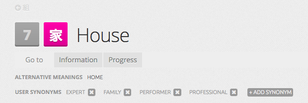

# WaniKani Bulk Add Kanji User Synonyms

## Description

This [WaniKani](https://www.wanikani.com) script automatically adds user synonyms to all your unlocked kanji using meaning synonyms collected from Jim Breen's [WWWJDIC](http://nihongo.monash.edu/cgi-bin/wwwjdic) database.

If you have any pre-existing user synonyms, the script attempts to preserve them. However, WaniKani only allows a maximum of 8 user synonyms per kanji. Any more synonyms beyond that are ignored by the script.

## Requirements

[Tampermonkey](http://tampermonkey.net/)

## Installation

1. Install @rfindley 's WaniKani Open Framework according to [these instructions](https://github.com/rfindley/wanikani-open-framework#installation).
2. Install this script from Greasyfork at https://greasyfork.org/en/scripts/39692-wanikani-bulk-add-kanji-user-synonyms

## Usage

Navigate to your dashboard (i.e. either <https://www.wanikani.com/> or <https://www.wanikani.com/dashboard>) and the script will automatically update your user synonyms.

## Debugging

You can set `DISABLE_ALL_LOGGING` to `false` and open your browser console to see what the script is doing. 

[Here](https://github.com/normful/wanikani-bulk-add-kanji-user-synonyms/blob/master/output.txt) is the console output, when I ran this on my account at WaniKani level 19.

## Changelog

- 1.0.0: Initial release
- 1.0.1: Default to not log anything
- 1.0.2: Fix handling of ampersands in WWWJDIC synonyms
- 1.0.3: Redirect to forum page if wkof is not installed.
- 1.0.4: Update description
- 1.0.5: Update script metadata
